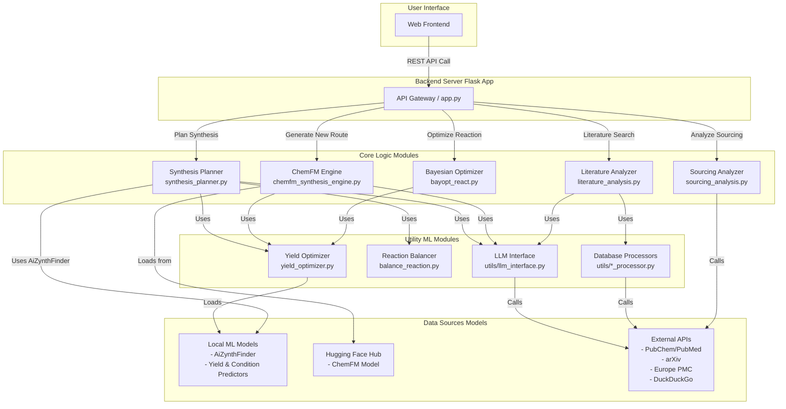

# ChemSynthAI

**ChemSynthAI** is a comprehensive, AI-powered web platform designed to accelerate chemical synthesis research. It serves as a computational copilot for chemists, integrating literature analysis, multiple retrosynthesis strategies, reaction optimization, and logistical planning into a single, cohesive workflow.

The platform leverages a hybrid approach, combining the structured, evidence-based predictions of traditional cheminformatics tools with the creative, pattern-recognition capabilities of modern large language models (LLMs) and deep learning.


---

## Table of Contents

- [Core Philosophy](#core-philosophy)
- [Key Features](#key-features)
- [System Architecture](#system-architecture)
- [Models and Datasets](#models-and-datasets)
- [Technology Stack](#technology-stack)
- [Installation and Setup](#installation-and-setup)
  - [Docker Installation (Recommended)](#docker-installation-recommended)
  - [Manual Installation](#manual-installation)
- [Running the Application](#running-the-application)
- [API Endpoints](#api-endpoints)
- [Project Structure](#project-structure)
- [How to Contribute](#how-to-contribute)
- [License](#license)
- [Acknowledgments](#acknowledgments)

---

## Core Philosophy

Modern chemistry research is a data-intensive endeavor. The path from a target molecule to a viable synthesis protocol is fraught with challenges: sifting through vast literature, conceptualizing novel pathways, optimizing reaction conditions, and sourcing starting materials.

**ChemSynthAI** is built on the philosophy of **AI-Augmented Chemical Intuition**. Our goal is not to replace the expert chemist but to provide a powerful suite of computational tools that can:

1. **Automate Tedious Tasks:** Instantly perform comprehensive literature and patent searches that would take a human researcher hours or days.
2. **Expand the Search Space:** Generate a diverse set of plausible synthesis routes, including both canonical, literature-backed pathways and novel, AI-generated suggestions.
3. **Provide Data-Driven Insights:** Move beyond simple retrosynthesis to predict reaction yields, propose optimal conditions (catalysts, solvents, temperature), and analyze the economic viability of a route.
4. **Integrate and Synthesize Information:** Use LLMs to summarize findings, elaborate on reaction mechanisms, and present complex data in a clear, human-readable format.

By blending deterministic algorithms (e.g., graph-based tree search) with probabilistic models (e.g., Transformers, generative models), the platform provides a robust, multi-faceted perspective on any synthesis problem.

---

## Key Features

### Multi-Source Literature Analysis
- Performs federated search across **arXiv**, **PubChem**, **PubMed**, **Europe PMC**, and the general web (**DuckDuckGo**)
- Employs a cascading search strategy, starting with highly specific queries and broadening scope for comprehensive coverage
- Uses intelligent scoring and filtering to rank results based on chemical relevance, source credibility, and keyword matching
- Automatically filters out noise from irrelevant fields (e.g., astrophysics, economics)

### Hybrid Retrosynthesis Engine
- **AiZynthFinder Integration:** Template-based, multi-step synthesis planning using USPTO patent database reactions
- **ChemFM Generative Engine:** Leverages `ChemFM-3B` foundation model to propose novel, single-step synthesis routes

### Advanced Reaction Optimization & Analysis
- **AI-Powered Yield Prediction:** Two-stage deep learning pipeline predicting optimal conditions and final yield
- **Interactive Bayesian Optimization:** On-demand optimization using **BayBE** library to explore reaction condition space
- **Stoichiometric Balancing:** Automatic equation balancing using Integer Linear Programming (ILP) solver

### Sourcing and Cost Analysis
- Identifies required starting materials for synthesis routes
- Performs stoichiometric flow-down calculations accounting for step yields
- Queries chemical supplier databases for availability and cost estimation

### LLM-Powered Elaboration
- Uses Google Gemini models to synthesize and format outputs
- Generates human-readable descriptions of reaction steps
- Evaluates pros/cons of proposed routes
- Structures final output into clean JSON format for frontend

---

## System Architecture

The platform is designed as a modular, service-oriented system with a central Flask application orchestrating requests to specialized backend modules.



### Component Breakdown

1. **Flask App (`app.py`):** Main entry point exposing REST API endpoints, handling request validation, and orchestrating core logic modules
2. **Synthesis Planner (`synthesis_planner.py`):** Primary retrosynthesis module initializing AiZynthFinder and processing routes
3. **ChemFM Engine (`chemfm_synthesis_engine.py`):** Queries ChemFM model for single-step retrosynthesis generation
4. **Bayesian Optimizer (`bayopt_react.py`):** On-demand optimization of reaction conditions using BayBE library
5. **Literature Analyzer (`literature_analysis.py`):** Orchestrates parallel searches across scientific databases
6. **Sourcing Analyzer (`sourcing_analysis.py`):** Calculates reagent requirements and queries supplier information
7. **Yield Optimizer (`yield_optimizer.py`):** Wraps neural networks for condition and yield prediction
8. **Utilities (`utils/`):** Helper modules for LLM API, prompt loading, and database communication

---

## Models and Datasets

| Component | Model / Dataset | Source | Purpose |
|-----------|----------------|--------|---------|
| **Retrosynthesis** | AiZynthFinder with USPTO models | Local (`core_logic/`) | Template-based, multi-step synthesis planning |
| **Retrosynthesis** | ChemFM-3B | Hugging Face Hub | Generative, single-step synthesis suggestion |
| **Condition Prediction** | NeuralNetContextRecommender (RCR) | Local (`models/model 2/`) | Predicts catalyst, solvent, reagent, temperature |
| **Yield Prediction** | SmilesClassificationModel (Transformer) | Local (`models/model/`) | Predicts reaction yield percentage |
| **Yield Optimization** | BayBE with Gaussian Process | `baybe` Python package | On-demand, iterative optimization |
| **Purchasable Reagents** | ZINC In-Stock Database | Local (`core_logic/zinc_stock.hdf5`) | Commercially available starting materials |
| **Literature** | PubChem, PubMed, arXiv, Europe PMC | Public APIs | Academic papers, patents, and articles |
| **General Knowledge** | Google Gemini family | Google AI Platform API | Text generation, summarization, formatting |
| **Thermodynamics** | chemicals library dataset | `chemicals` Python package | Enthalpy, entropy, boiling/melting points |

---

## Technology Stack

- **Containerization:** Docker
- **Backend Framework:** Flask, Gunicorn
- **Machine Learning:** PyTorch, Hugging Face Transformers, JAX
- **Bayesian Optimization:** BayBE
- **Cheminformatics:** RDKit, AiZynthFinder, PubChemPy
- **Numerical Computing:** NumPy, Pandas, SciPy
- **Scientific Libraries:** chemicals, pulp (ILP)
- **API Interaction:** requests, arxiv, biopython
- **Environment Management:** Conda

---

## Installation and Setup

### Docker Installation (Recommended)

Using Docker is the **recommended method** for running this application. It guarantees a consistent and reproducible environment, automatically handling all complex Python and system dependencies.

#### Prerequisites
- [Git](https://git-scm.com/)
- [Docker Desktop](https://www.docker.com/products/docker-desktop/) (or Docker Engine on Linux)

#### Steps

1. **Clone the Repository**
   ```bash
   git clone https://github.com/your-username/ChemSynthAI.git
   cd ChemSynthAI
   ```

2. **Configure Models (Before Building)**
   
   Download and place models in local directories:
   - **AiZynthFinder Models:** Download USPTO models and place in `core_logic/`
   - **Custom Models:** Place yield/condition models in `models/model/` and `models/model 2/`
   - **ZINC Database:** Place `zinc_stock.hdf5` in `core_logic/`
   
   Create `core_logic/config.yml` with **container paths**:
   ```yaml
   policy:
     uspto:
       type: "template-based"
       model: "/app/core_logic/uspto_model.onnx"
       templates: "/app/core_logic/uspto_templates.csv.gz"
     ringbreaker:
       type: "template-based"
       model: "/app/core_logic/uspto_ringbreaker_model.onnx"
       templates: "/app/core_logic/uspto_ringbreaker_templates.csv.gz"
     filter:
       uspto:
         type: "neural-network"
         model: "/app/core_logic/uspto_filter_model.onnx"

   stock:
     zinc:
       type: "hdf5"
       path: "/app/core_logic/zinc_stock.hdf5"
   ```
   *Note: Use `/app/` paths since these will be mounted inside the container*

3. **Set Up Environment Variables**
   Create a `.env` file in the root directory:
   ```ini
   # .env
   GEMINI_API_KEY="your_google_ai_platform_api_key"
   EMAIL="your_email_for_ncbi_api@example.com"
   ```

4. **Build Docker Image**
   ```bash
   docker build -t chemsynth-ai .
   ```

5. **Run with Volume Mounts**
   ```bash
   docker run -d \
     -p 5000:5000 \
     --name chemsynth-container \
     --env-file .env \
     -v "$(pwd)/core_logic:/app/core_logic" \
     -v "$(pwd)/models:/app/models" \
     chemsynth-ai
   ```
   
   **What these flags do:**
   - `-d`: Run in detached mode (background)
   - `-p 5000:5000`: Map port 5000 (host:container)
   - `--name`: Give container a memorable name
   - `--env-file`: Load API keys from `.env`
   - `-v`: Mount local model directories into container
   
   This approach keeps models on your host machine and shares them with the container. **No reconfiguration needed** once models are set up locally!

6. **Access the Application**
   Open your browser to `http://localhost:5000`

7. **View Logs (Optional)**
   ```bash
   docker logs -f chemsynth-container
   ```

8. **Stop the Container**
   ```bash
   docker stop chemsynth-container
   docker rm chemsynth-container
   ```

---

### Manual Installation

#### Prerequisites
- Python 3.9+
- Conda package manager
- Git

#### Steps

1. **Clone the Repository**
   ```bash
   git clone https://github.com/your-username/ChemSynthAI.git
   cd ChemSynthAI
   ```

2. **Create and Activate Conda Environment**
   ```bash
   conda create -n chemsynth python=3.9
   conda activate chemsynth
   ```

3. **Install Core Dependencies**
   ```bash
   conda install -c conda-forge rdkit pytorch torchvision torchaudio -y
   ```

4. **Install Python Packages**
   ```bash
   pip install -r requirements.txt
   ```

5. **Download and Configure Models**

   Create model directories:
   ```bash
   mkdir -p models/model models/model\ 2
   ```

   Download models and place in respective directories:
   - **AiZynthFinder Models:** Follow [official instructions](https://github.com/MolecularAI/aizynthfinder)
   - **Custom Models:** Place in `models/model` and `models/model 2`

6. **Configure AiZynthFinder**
   
   Create `core_logic/config.yml`:
   ```yaml
   policy:
     uspto:
       type: "template-based"
       model: "/path/to/uspto_model.onnx"
       templates: "/path/to/uspto_templates.csv.gz"
     ringbreaker:
       type: "template-based"
       model: "/path/to/uspto_ringbreaker_model.onnx"
       templates: "/path/to/uspto_ringbreaker_templates.csv.gz"
     filter:
       uspto:
         type: "neural-network"
         model: "/path/to/uspto_filter_model.onnx"

   stock:
     zinc:
       type: "hdf5"
       path: "/path/to/zinc_stock.hdf5"
   ```

7. **Set Up Environment Variables**
   ```bash
   # Create .env file
   echo 'GEMINI_API_KEY="your_api_key"' > .env
   echo 'EMAIL="your_email@example.com"' >> .env
   ```

---

## Running the Application

### With Docker
```bash
docker run -p 5000:5000 --env-file .env chemsynthai
```

### Manual
```bash
conda activate chemsynth
python app.py
```

The application will be available at `http://127.0.0.1:5000`

---

## API Endpoints

### `POST /api/resolve_identifier`
Resolves a chemical identifier to canonical SMILES.

**Request:**
```json
{ "identifier": "aspirin" }
```

**Response:**
```json
{
  "smiles": "CC(=O)OC1=CC=CC=C1C(=O)O",
  "name": "Aspirin",
  "synonyms": ["Aspirin", "2-acetyloxybenzoic acid"]
}
```

---

### `POST /api/literature_search`
Performs comprehensive literature search.

**Request:**
```json
{
  "query": "Ibuprofen",
  "max_results": 5
}
```

**Response:**
```json
{
  "papers": [
    {
      "title": "Synthesis of Ibuprofen...",
      "source": "Doe J, et al. (2021)",
      "abstract": "...",
      "url": "https://doi.org/...",
      "relevance_score": 25
    }
  ],
  "web_results": [],
  "search_info": {}
}
```

---

### `POST /api/plan_synthesis`
Generates multi-step synthesis routes.

**Request:**
```json
{ "identifier": "CC(C)CC1=CC=C(C=C1)C(C)C(=O)O" }
```

**Response:**
```json
{
  "routes": [
    {
      "id": "route_a",
      "overall_yield": 75.2,
      "steps": [
        {
          "step_number": 1,
          "title": "Friedel-Crafts Acylation",
          "yield": 85.0,
          "reagents_conditions": "Catalyst: AlCl3",
          "product": {"smiles": "...", "coeff": 1},
          "reactants": [{"smiles": "...", "coeff": 1}],
          "reaction_image_url": "/static/reactions/..."
        }
      ],
      "evaluation": {
        "advantages": "Uses common starting materials",
        "challenges": "Moderate yield in final step"
      }
    }
  ]
}
```

---

### `POST /api/generate_new_route`
Generates novel route using ChemFM.

**Request:**
```json
{
  "target_smiles": "...",
  "suggestion": "Propose a route using Suzuki coupling"
}
```

**Response:**
```json
{ "new_route": { } }
```

---

### `POST /api/analyze_sourcing`
Analyzes cost and sourcing logistics.

**Request:**
```json
{
  "route_steps": [],
  "target_amount_g": 10.0
}
```

**Response:**
```json
{
  "total_cost": 250.75,
  "sourcing_details": {
    "smiles": {
      "name": "...",
      "required_amount_g": 15.2,
      "estimated_cost": 120.50,
      "suppliers": []
    }
  }
}
```

---

### `GET /api/health`
Health check endpoint.

**Response:**
```json
{
  "status": "healthy",
  "pubchem_available": true
}
```

---

## Project Structure

```
ChemSynthAI/
├── core_logic/
│   ├── chemfm_synthesis_engine.py
│   ├── config.yml
│   ├── literature_analysis.py
│   ├── sourcing_analysis.py
│   ├── synthesis_planner.py
│   ├── uspto_filter_model.onnx
│   ├── uspto_model.onnx
│   ├── uspto_ringbreaker_model.onnx
│   ├── uspto_ringbreaker_templates.csv.gz
│   ├── uspto_templates.csv.gz
│   └── zinc_stock.hdf5
├── models/
│   ├── model/                     # Yield prediction model
│   ├── model 2/                   # Condition prediction model
│   └── packages/
│       ├── rcr_torch_version/
│       └── yield_predictor/
├── static/
│   ├── css/
│   ├── js/
│   └── reaction_images/
├── templates/
│   └── index.html
├── utils/
│   ├── prompts/
│   ├── arxiv_processor.py
│   ├── balance_reaction.py
│   ├── bayopt_backup.py
│   ├── bayopt_react.py
│   ├── chemrxiv.py
│   ├── custom_tokenizer.py
│   ├── europe_pmc_processor.py
│   ├── github_analyzer.py
│   ├── google_patents_processor.py
│   ├── llm_interface.py
│   ├── prompt_loader.py
│   ├── pubchem_processor.py
│   ├── reaction_utils.py
│   ├── scifinder_processor.py
│   ├── semantic_scholar_processor.py
│   ├── web_scraper.py
│   ├── web_searcher.py
│   └── yield_optimizer.py
├── app.py
├── config.py
├── requirements.txt
├── .env
├── .gitignore
└── README.md
```

---

## How to Contribute

We welcome contributions from the community! Please follow these guidelines:

1. Fork the repository
2. Create a feature branch (`git checkout -b feature/amazing-feature`)
3. Commit your changes (`git commit -m 'Add amazing feature'`)
4. Push to the branch (`git push origin feature/amazing-feature`)
5. Open a Pull Request

---

## License

This project is licensed under the MIT License. See the `LICENSE` file for details.

---

## Acknowledgments

This platform would not be possible without the foundational work of many researchers and developers:

- The **RDKit** team for the essential open-source cheminformatics toolkit
- The **Molecular AI** group at AstraZeneca for developing **AiZynthFinder**
- The researchers behind **ChemFM** for creating a powerful foundation model for chemistry
- The developers of **PubChemPy**, **BioPython**, **BayBE**, and numerous other open-source libraries
- The scientific community for maintaining open databases like PubChem, PubMed, arXiv, and Europe PMC

---

**ChemSynthAI** - Accelerating chemistry research through intelligent automation and AI-powered insights.
