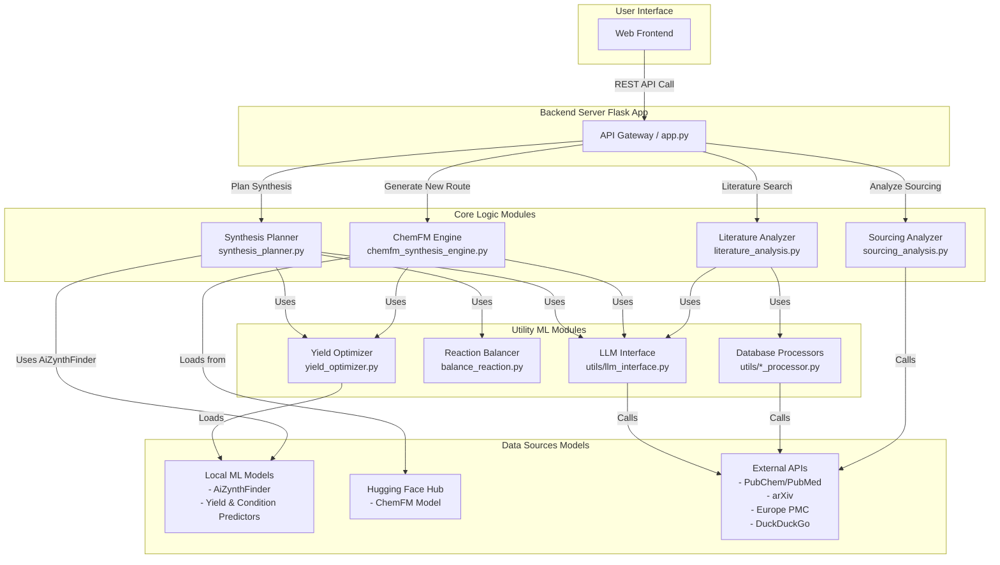

# ChemSynthAi
**Synthesis Navigator AI** is a comprehensive, AI-powered web platform designed to accelerate chemical synthesis research. It serves as a computational copilot for chemists, integrating literature analysis, multiple retrosynthesis strategies, reaction optimization, and logistical planning into a single, cohesive workflow.

The platform leverages a hybrid approach, combining the structured, evidence-based predictions of traditional cheminformatics tools with the creative, pattern-recognition capabilities of modern large language models (LLMs) and deep learning.

 
*(Placeholder for a GIF demonstrating the web UI in action)*

---

## Table of Contents

- [Core Philosophy](#core-philosophy)
- [Key Features](#key-features)
- [System Architecture](#system-architecture)
- [Models and Datasets](#models-and-datasets)
- [Technology Stack](#technology-stack)
- [Installation and Setup](#installation-and-setup)
  - [Prerequisites](#prerequisites)
  - [Step-by-Step Installation](#step-by-step-installation)
  - [Model and Configuration Setup](#model-and-configuration-setup)
- [Running the Application](#running-the-application)
- [API Endpoints](#api-endpoints)
- [How to Contribute](#how-to-contribute)
- [License](#license)
- [Acknowledgments](#acknowledgments)

## Core Philosophy

Modern chemistry research is a data-intensive endeavor. The path from a target molecule to a viable synthesis protocol is fraught with challenges: sifting through vast literature, conceptualizing novel pathways, optimizing reaction conditions, and sourcing starting materials.

**Synthesis Navigator AI** is built on the philosophy of **AI-Augmented Chemical Intuition**. Our goal is not to replace the expert chemist but to provide a powerful suite of computational tools that can:

1.  **Automate Tedious Tasks:** Instantly perform comprehensive literature and patent searches that would take a human researcher hours or days.
2.  **Expand the Search Space:** Generate a diverse set of plausible synthesis routes, including both canonical, literature-backed pathways and novel, AI-generated suggestions.
3.  **Provide Data-Driven Insights:** Move beyond simple retrosynthesis to predict reaction yields, propose optimal conditions (catalysts, solvents, temperature), and analyze the economic viability of a route.
4.  **Integrate and Synthesize Information:** Use LLMs to summarize findings, elaborate on reaction mechanisms, and present complex data in a clear, human-readable format.

By blending deterministic algorithms (e.g., graph-based tree search) with probabilistic models (e.g., Transformers, generative models), the platform provides a robust, multi-faceted perspective on any synthesis problem.

## Key Features

- **Multi-Source Literature Analysis:**
  - Performs a federated search across **arXiv**, **PubChem**, **Europe PMC**, and the general web (**DuckDuckGo**) to find relevant papers, patents, and technical articles.
  - Employs a cascading search strategy, starting with highly specific queries and broadening the scope to ensure comprehensive coverage.
  - Uses an intelligent scoring and filtering system to rank results based on chemical relevance, source credibility, and keyword matching, removing noise from irrelevant fields (e.g., astrophysics, economics).

- **Hybrid Retrosynthesis Engine:**
  - **AiZynthFinder Integration:** Utilizes the industry-standard `AiZynthFinder` tool to perform a rigorous, template-based retrosynthetic analysis, generating multi-step pathways grounded in known chemical reactions from the USPTO patent database.
  - **ChemFM Generative Engine:** Leverages `ChemFM-3B`, a foundation model for chemistry, to propose novel, single-step synthesis routes, offering creative alternatives to established methods.

- **Advanced Reaction Optimization & Analysis:**
  - **AI-Powered Yield Prediction:** Integrates a two-stage deep learning pipeline. First, it predicts optimal reaction conditions (catalysts, reagents, solvents, temperature). Then, it feeds the fully-specified reaction into a Transformer-based model to predict the final yield with high accuracy.
  - **Stoichiometric Balancing:** Automatically balances complex chemical equations using an Integer Linear Programming (ILP) solver, ensuring atom conservation and providing correct stoichiometric coefficients for all reactants, products, and byproducts.

- **Sourcing and Cost Analysis:**
  - Identifies all required starting materials for a given synthesis route.
  - Performs a stoichiometric flow-down calculation to determine the mass of each starting material needed to produce a target amount of the final product, accounting for the yield of each step.
  - Queries chemical supplier databases (via PubChem and mock vendor APIs) to find availability and estimate the total cost of a synthesis route.

- **LLM-Powered Elaboration:**
  - Uses a general-purpose LLM (e.g., Google Gemini) to synthesize and format the output from various backend modules.
  - The LLM generates human-readable descriptions of reaction steps, evaluates the pros and cons of a proposed route, and structures the final output into a clean JSON format for the frontend.

## System Architecture

The platform is designed as a modular, service-oriented system with a central Flask application orchestrating requests to specialized backend modules.



**Component Breakdown:**

1.  **Flask App (`app.py`):** The main entry point. It exposes all REST API endpoints, handles request validation, and orchestrates calls to the various core logic modules.
2.  **Synthesis Planner (`synthesis_planner.py`):** The primary module for retrosynthesis. It initializes `AiZynthFinder`, runs the tree search, processes the resulting routes, and integrates yield prediction, balancing, and LLM elaboration for each step.
3.  **ChemFM Engine (`chemfm_synthesis_engine.py`):** A specialized module that queries the `ChemFM` model to generate a single-step retrosynthesis. It pipelines this result into the yield optimizer and LLM formatter.
4.  **Literature Analyzer (`literature_analysis.py`):** Orchestrates parallel searches across multiple scientific databases. It includes logic for deduplicating, scoring, and ranking results for relevance.
5.  **Sourcing Analyzer (`sourcing_analysis.py`):** Contains the logic for calculating reagent mass requirements and querying supplier information. It includes a cache and fallback mechanisms for robustness.
6.  **Yield Optimizer (`yield_optimizer.py`):** A critical ML module that wraps two separate neural networks: one for predicting conditions and another for predicting yield.
7.  **Utilities (`utils/`):** A collection of helper modules for common tasks like interfacing with the LLM API (`llm_interface.py`), loading prompts (`prompt_loader.py`), and communicating with specific databases (`arxiv_processor.py`, `pubchem_processor.py`, etc.).

## Models and Datasets

The platform's capabilities are powered by a suite of state-of-the-art models and public datasets.

| Component                 | Model / Dataset                                                                                                 | Source                                                                             | Purpose                                                 |
| ------------------------- | --------------------------------------------------------------------------------------------------------------- | ---------------------------------------------------------------------------------- | ------------------------------------------------------- |
| **Retrosynthesis**        | `AiZynthFinder` with USPTO models                                                                               | `aizynthfinder` package                                                            | Template-based, multi-step synthesis planning.        |
| **Retrosynthesis**        | `ChemFM-3B`                                                                                                     | Hugging Face Hub (`ChemFM/ChemFM-3B`)                                              | Generative, single-step synthesis suggestion.         |
| **Condition Prediction**  | Custom `NeuralNetContextRecommender` (RCR)                                                                      | Local (`models/model 2/`)                                                          | Predicts catalyst, solvent, reagent, temperature.     |
| **Yield Prediction**      | Custom Transformer `SmilesClassificationModel`                                                                  | Local (`models/model/`)                                                            | Predicts reaction yield percentage.                     |
| **Purchasable Reagents**  | ZINC In-Stock Database (`zinc_stock.hdf5`)                                                                      | ZINC Database                                                                      | Defines commercially available starting materials.      |
| **Literature**            | PubChem, PubMed, arXiv, Europe PMC                                                                              | Public APIs                                                                        | Sourcing academic papers, patents, and articles.      |
| **General Knowledge**     | Google Gemini family of models                                                                                  | Google AI Platform API                                                             | Text generation, summarization, and formatting.         |
| **Thermodynamics**        | `chemicals` library dataset                                                                                     | `chemicals` Python package                                                         | Enthalpy, entropy, boiling/melting points for balancing.|

## Technology Stack

- **Backend Framework:** Flask
- **Machine Learning:** PyTorch, Hugging Face Transformers, JAX (via ChemFM dependencies)
- **Cheminformatics:** RDKit, AiZynthFinder, PubChemPy
- **Numerical Computing:** NumPy, Pandas, SciPy
- **Scientific Libraries:** `chemicals`, `pulp` (for ILP)
- **API Interaction:** `requests`, `arxiv`, `biopython`
- **Environment:** Conda (recommended for managing complex dependencies)

## Installation and Setup

### Prerequisites

- Python 3.9+
- Conda package manager
- Git

### Step-by-Step Installation

1.  **Clone the Repository**
    ```bash
    git clone https://github.com/your-username/synthesis-navigator-ai.git
    cd synthesis-navigator-ai
    ```

2.  **Create and Activate Conda Environment**
    It is highly recommended to use a dedicated Conda environment to manage the complex dependencies of `rdkit`, `pytorch`, and `aizynthfinder`.

    ```bash
    conda create -n chemsynth python=3.9
    conda activate chemsynth
    ```

3.  **Install Core Dependencies**
    Install `rdkit` and `pytorch` from the `conda-forge` channel for best compatibility.

    ```bash
    conda install -c conda-forge rdkit pytorch torchvision torchaudio -y
    ```

4.  **Install AiZynthFinder and Other Python Packages**
    Create a `requirements.txt` file with the following content:
    ```txt
    # requirements.txt
    aizynthfinder
    flask
    numpy
    pandas
    scipy
    huggingface_hub
    transformers
    tensorflow  # Often a dependency for aizynthfinder models
    pulp
    pubchempy
    biopython
    arxiv
    python-dotenv
    PyYAML
    requests
    duckduckgo_search
    chemicals
    ```
    Then, install them using `pip`:
    ```bash
    pip install -r requirements.txt
    ```

### Model and Configuration Setup

1.  **Create Model Directories**
    The application expects local models to be in a specific structure.

    ```bash
    mkdir -p models/model models/model\ 2
    ```

2.  **Download and Place Models**
    - **AiZynthFinder Models:** Follow the [official AiZynthFinder instructions](https://github.com/MolecularAI/aizynthfinder) to download the policy models and the stock data (`zinc_stock.hdf5`). Place them in a location accessible to the application.
    - **Custom Yield/Condition Models:** Download the `model` and `model 2` directories from your model repository and place their contents into the respective directories created above.

3.  **Configure AiZynthFinder**
    Create a `config.yml` file in the `core_logic/` directory. This file tells `AiZynthFinder` where to find its models and stock data. **Update the paths to match your system.**

    ```yaml
    # core_logic/config.yml
    policy:
      uspto:
        type: "template-based"
        model: "/path/to/your/aizynthfinder/models/uspto-expansion.onnx"
        templates: "/path/to/your/aizynthfinder/models/uspto-expansion.csv.gz"
      ringbreaker:
        type: "template-based"
        model: "/path/to/your/aizynthfinder/models/ringbreaker-expansion.onnx"
        templates: "/path/to/your/aizynthfinder/models/ringbreaker-expansion.csv.gz"
      
      # Filter policy is separate
      filter:
        uspto:
          type: "neural-network"
          model: "/path/to/your/aizynthfinder/models/uspto-filter.onnx"

    stock:
      zinc:
        type: "hdf5"
        path: "/path/to/your/zinc_stock.hdf5"
    ```

4.  **Set Up Environment Variables**
    Create a `.env` file in the root directory of the project to store your API keys and other secrets.

    ```ini
    # .env
    GEMINI_API_KEY="your_google_ai_platform_api_key"
    EMAIL="your_email_for_ncbi_api@example.com"
    # Optional: TOR proxy settings for web searcher
    # TOR_PROXY_IP="127.0.0.1"
    # TOR_PROXY_PORT="9050"
    ```

## Running the Application

Once all dependencies are installed and configurations are in place, you can run the Flask web server:

```bash
conda activate chemsynth
python app.py
```

The application will be available at `http://127.0.0.1:5000`.

## API Endpoints

The application exposes a REST API for programmatic access.

---
**`POST /api/resolve_identifier`**
-   Resolves a chemical identifier (Name, CAS, SMILES) to a canonical SMILES string and common name.
-   **Request Body:**
    ```json
    { "identifier": "aspirin" }
    ```
-   **Success Response (200):**
    ```json
    {
      "smiles": "CC(=O)OC1=CC=CC=C1C(=O)O",
      "name": "Aspirin",
      "synonyms": ["Aspirin", "2-acetyloxybenzoic acid", ...]
    }
    ```
---
**`POST /api/literature_search`**
-   Performs a comprehensive literature search.
-   **Request Body:**
    ```json
    {
      "query": "Ibuprofen",
      "max_results": 5
    }
    ```
-   **Success Response (200):**
    ```json
    {
      "papers": [
        {
          "title": "Synthesis of Ibuprofen...",
          "source": "Doe J, et al. (2021) - PubChem/PubMed",
          "abstract": "The synthesis of ibuprofen was achieved...",
          "url": "https://doi.org/...",
          "relevance_score": 25
        }
      ],
      "web_results": [...],
      "search_info": { ... }
    }
    ```
---
**`POST /api/plan_synthesis`**
-   Generates multi-step synthesis routes using `AiZynthFinder`.
-   **Request Body:**
    ```json
    { "identifier": "CC(C)CC1=CC=C(C=C1)C(C)C(=O)O" }
    ```
-   **Success Response (200):**
    ```json
    {
      "routes": [
        {
          "id": "route_a",
          "overall_yield": 75.2,
          "steps": [
            {
              "step_number": 1,
              "title": "Friedel-Crafts Acylation",
              "yield": 85.0,
              "reagents_conditions": "Catalyst: AlCl3; ...",
              "product": {"smiles": "...", "coeff": 1},
              "reactants": [{"smiles": "...", "coeff": 1}],
              "reaction_image_url": "/static/reactions/..."
            }
          ],
          "evaluation": {
            "advantages": "Uses common starting materials.",
            "challenges": "The final step has a moderate yield."
          }
        }
      ]
    }
    ```
---
**`POST /api/generate_new_route`**
-   Generates a novel, single-step route using `ChemFM`.
-   **Request Body:**
    ```json
    {
      "target_smiles": "...",
      "suggestion": "Propose a route using a Suzuki coupling."
    }
    ```
-   **Success Response (200):**
    ```json
    { "new_route": { ... } } // Same format as a single route from /api/plan_synthesis
    ```
---
**`POST /api/analyze_sourcing`**
-   Analyzes the cost and sourcing logistics for a given route.
-   **Request Body:**
    ```json
    {
      "route_steps": [ ... ], // The "steps" array from a planned route
      "target_amount_g": 10.0
    }
    ```
-   **Success Response (200):**
    ```json
    {
      "total_cost": 250.75,
      "sourcing_details": {
        "smiles_of_reagent": {
          "name": "...",
          "required_amount_g": 15.2,
          "estimated_cost": 120.50,
          "suppliers": [ ... ]
        }
      },
      ...
    }
    ```
---
**`GET /api/health`**
-   A health check endpoint to verify system status.
-   **Success Response (200):**
    ```json
    {
        "status": "healthy",
        "pubchem_available": true,
        ...
    }
    ```
---

## Acknowledgments

This platform would not be possible without the foundational work of many researchers and developers. We extend our sincere gratitude to:
-   The **RDKit** team for providing the essential open-source cheminformatics toolkit.
-   The **Molecular AI** group at AstraZeneca for developing and maintaining **AiZynthFinder**.
-   The researchers behind **ChemFM** for creating a powerful foundation model for chemistry.
-   The developers of **PubChemPy**, **BioPython**, and the numerous other open-source libraries that form the backbone of this application.